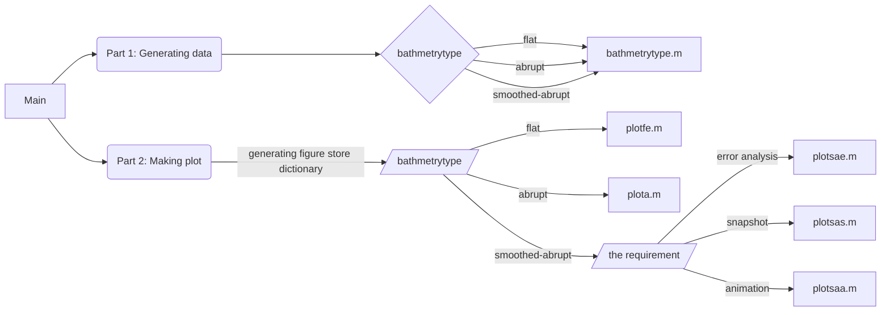

# Instruction of my program to Assingment 3
This is a program about using SSP-RK method to numerical approximate the wave propagating in an abrupt bathmetry.
## Flow Chart

## Others
1. the data has generated. Could run the part 2 of Main.m directly.

