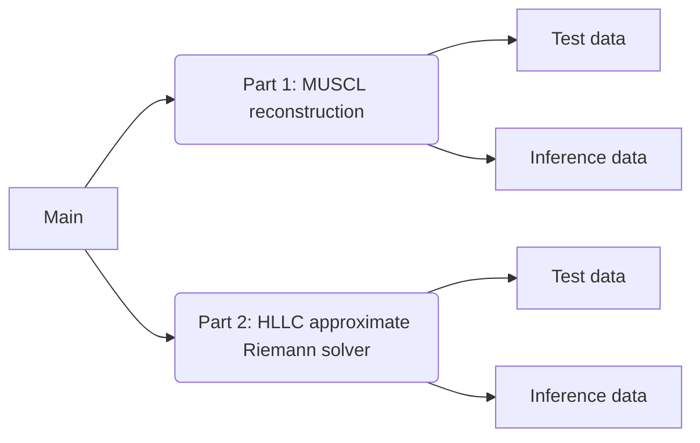

# Instruction of my program to Assingment 5
This is a program involving MUSCL reconstruction and HLLC approximate Riemann solver
By input Test data, compare the ouput data with Validation data. And input inference data.
## Flow Chart

## Others
1. The code will generate the data throught process Part 1 and Part 2. 
