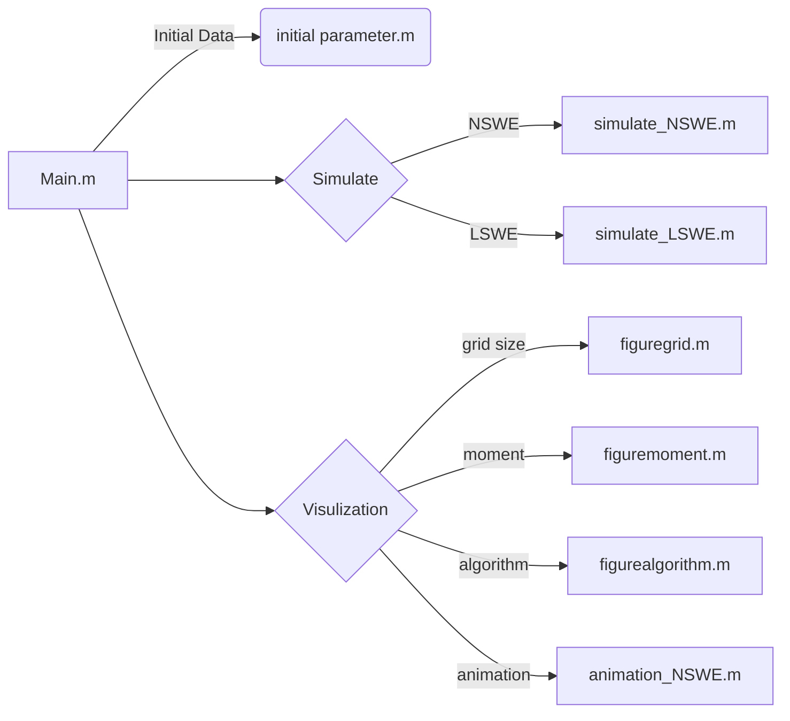

# The Instruction of Assignment6
This is the programs to solve the problem of Assignment 6, By use the "Main.m" program to call other subprogram to help simulate a wave translated in a wave flume.
## Flow Chart

## Others
### Main loop (In simulate_****.m)
```matlab
while tnow<tend
    u_CFL = max(abs(Unow)+sqrt(g*Hnow));
    dt = C_CFL*dx/u_CFL;
    
    if tnow+dt>=t_target(counts) % 判斷下一時刻點是否超過欲紀錄之指定時刻
        dt_temp = t_target(counts)-tnow; %更改時間步
        [etanow, Unow, Hnow] = wv.ssprkB(etanow, Unow, h, hp, hm, dt_temp, dx, nL); %將參數輸入ssprk程序
        eta{counts} = etanow; tlist(counts) = tnow; tnow = tnow+dt_temp; %下一個時刻點
        %fprintf("tnow = %.2f, dt = %.4e\n",tnow, dt_temp);%紀錄是否抵達指定時刻
        %fprintf('specific time %d arrived\n', counts);
        counts = counts+1; %使指定時刻點的指標+1        
    else
        dt_temp = dt;
        [etanow, Unow, Hnow] = wv.ssprkB(etanow, Unow, h, hp, hm, dt_temp, dx, nL);
        tnow = tnow+dt_temp;
        if ~isreal(etanow) %若有複數，則中斷程式
            disp('There is complex number');
            break;
        end
    end
    allcount = allcount+1;
end
```
