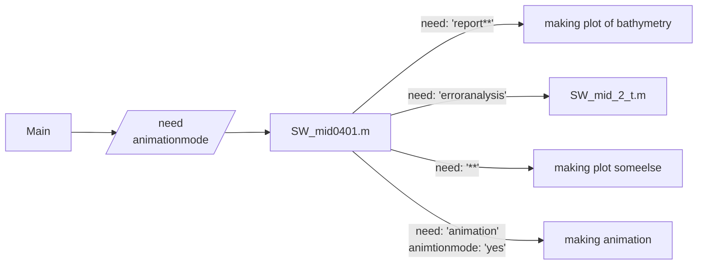

# Midterm Report
這份報告旨在藉由一維線性淺水波方程及SSP-RK數值方法去模擬簡化的海嘯行進問題。 
海床水深資料來源為 https://www.gebco.net/ 
此處儲存程式及相關資料、圖片等 
可見模擬結果動畫於https://youtu.be/b3keXdZv-GE
## FlowChart

-------------------------------------------------------------------------
The code development was made possible thanks to teammate’s efforts.
