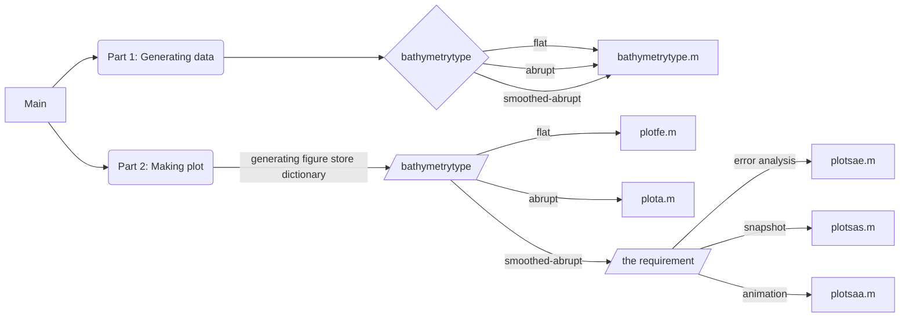

# Midterm Report
這份報告旨在藉由一維線性淺水波方程及SSP-RK數值方法去模擬簡化的海嘯行進問題。
海床水深資料來源為 https://www.gebco.net/

This report aims to by 1D-LSWE and SSP-RK numerical scheme simulating a simplified tsunami propagation problem.
data source of nearshore water depth: https://www.gebco.net/
## 報告流程

-------------------------------------------------------------------------
The code development was made possible thanks to my dear teammate’s efforts.
